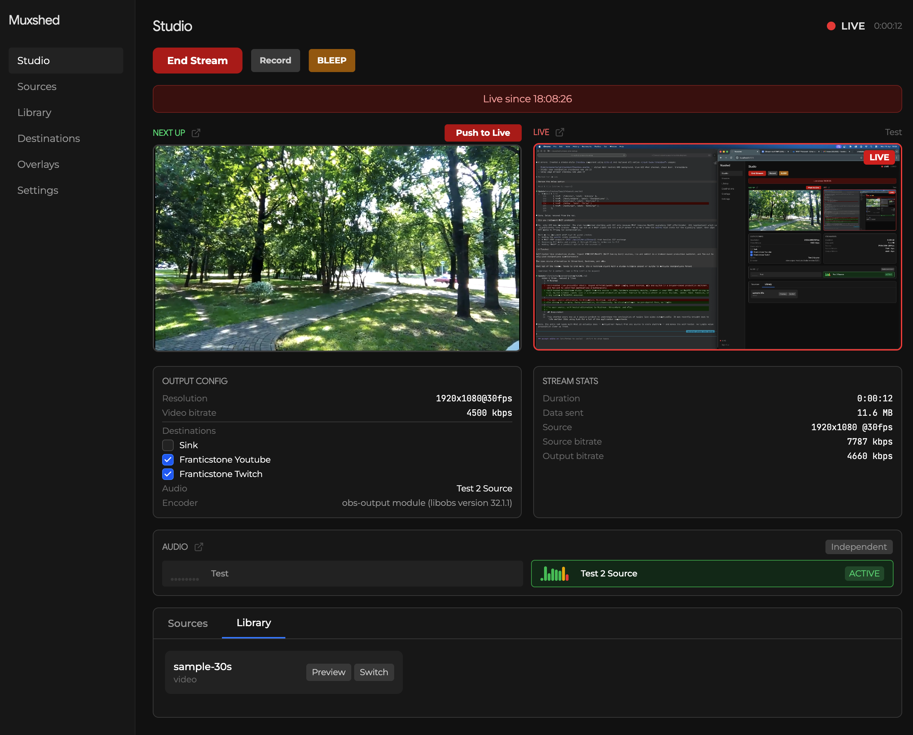

# Muxshed

Self-hosted multistream studio. Ingest from any source -- OBS, hardware encoders, mobile, browser -- over RTMP, SRT, or WebRTC (WHIP coming soon). Switch between inputs live in a browser-based production switcher. Fan-out to every platform at once: YouTube, Twitch, Kick, Facebook, or any custom RTMP/RTMPS endpoint.

One stream in, or many. Every destination, simultaneously. No cloud middleman, no per-channel fees, no limits.

The open source, self-hosted alternative to Restream, StreamYard, and vMix.



## Inspiration

This started years ago as a passion project to understand the complexities of muxing live video automatically. It was recently brought back to life earlier 2026 using Rust for a lot of the application compontents. 

## Features

- RTMP and SRT ingest from OBS, encoders, or any streaming software
- Fan-out to YouTube, Twitch, Kick, and any custom RTMP/RTMPS endpoint
- Scene management with multi-layer compositor
- Stinger transitions with frame-accurate marker editing
- Image overlays and lower thirds
- Broadcast delay with manual bleep
- Local recording
- WebRTC guest links
- API key authentication
- Real-time WebSocket state feed

### Coming Soon
- Whip Support
- Stream Deck and Bitfocus Companion support

## Architecture

```
crates/
  api/         Axum REST + WebSocket API server
  processor/   GStreamer pipeline management
  common/      Shared types, config, errors
web/           SvelteKit frontend (TypeScript, Tailwind)
docker/        Dockerfile, compose files, Unraid template
migrations/    SQLite migrations
```

The API server uses a `PipelineController` trait with two implementations:
- **StubPipelineController** for development without GStreamer (simulates state transitions)
- **GstPipelineController** for production with full GStreamer pipeline (feature-gated)

## Requirements

### Source (local development)

- Rust 1.84+ and Cargo
- Node.js 20+ and npm
- GStreamer is **not** required for dev mode (stub controller simulates the pipeline)
- GStreamer 1.20+ is required if you want to run the real pipeline locally (see below)

### Docker / Podman

- Docker 24+ or Podman 4+
- docker compose or podman-compose

## Installing Dependencies from Source

### Rust

```sh
# Install via rustup (https://rustup.rs)
curl --proto '=https' --tlsv1.2 -sSf https://sh.rustup.rs | sh
```

### Node.js

```sh
# Install via nvm (https://github.com/nvm-sh/nvm)
nvm install 20
nvm use 20
```

### GStreamer (optional, only needed for real pipeline)

Dev mode uses the stub controller and does not need GStreamer. Install GStreamer only if you want to test RTMP ingest, fan-out, and recording locally.

#### macOS

```sh
brew install gstreamer gst-plugins-base gst-plugins-good gst-plugins-bad gst-plugins-ugly gst-libav
```

#### Ubuntu / Debian

```sh
sudo apt-get update
sudo apt-get install -y \
    gstreamer1.0-tools \
    gstreamer1.0-plugins-base \
    gstreamer1.0-plugins-good \
    gstreamer1.0-plugins-bad \
    gstreamer1.0-plugins-ugly \
    gstreamer1.0-libav \
    gstreamer1.0-gl \
    libgstreamer1.0-dev \
    libgstreamer-plugins-base1.0-dev \
    libgstreamer-plugins-bad1.0-dev \
    pkg-config
```

#### Fedora / RHEL

```sh
sudo dnf install -y \
    gstreamer1 \
    gstreamer1-plugins-base \
    gstreamer1-plugins-good \
    gstreamer1-plugins-bad-free \
    gstreamer1-plugins-ugly-free \
    gstreamer1-libav \
    gstreamer1-devel \
    gstreamer1-plugins-base-devel
```

#### Arch Linux

```sh
sudo pacman -S gstreamer gst-plugins-base gst-plugins-good gst-plugins-bad gst-plugins-ugly gst-libav
```

#### Windows

Download the MSVC development and runtime installers from [gstreamer.freedesktop.org](https://gstreamer.freedesktop.org/download/). Install both, then set `PKG_CONFIG_PATH` to the GStreamer `lib/pkgconfig` directory.

#### Verifying the installation

```sh
gst-launch-1.0 --version
```

#### Building with GStreamer enabled

```sh
cargo build --features muxshed-processor/gstreamer
```

Without the `gstreamer` feature flag, the API uses the stub controller (default for development).

## Quick Start

### Source

```sh
cd system
./dev.sh
```

This builds and runs the API on `http://localhost:8080` and the frontend dev server on `http://localhost:5173`. The frontend proxies API requests to the backend automatically.

On first run, a default API key is printed to the console. Copy it and enter it in the frontend when prompted.

### Docker

```sh
cd system
./dev-docker.sh
```

Builds a dev image (no GStreamer, stub controller, debug logging) and starts on `http://localhost:8080`. The frontend is served directly by the API.

### Podman

```sh
cd system
./dev-podman.sh
```

Same as Docker but uses `podman compose`.

### Production Docker

```sh
cd system/docker
docker compose up --build
```

Builds the full production image with GStreamer and all plugins. Ports:

| Port | Protocol | Purpose |
|------|----------|---------|
| 8080 | TCP | Web UI + API |
| 1935 | TCP | RTMP ingest |
| 9000 | UDP | SRT ingest |
| 8443 | TCP | WebRTC signalling |

## Configuration

All configuration is via environment variables. See `.env.example` for the full list.

| Variable | Default | Description |
|----------|---------|-------------|
| `MUXSHED_LISTEN_ADDR` | `0.0.0.0:8080` | API server bind address |
| `MUXSHED_RTMP_PORT` | `1935` | RTMP ingest port |
| `MUXSHED_DB_PATH` | `muxshed.db` | SQLite database file path |
| `MUXSHED_DATA_DIR` | `data` | Directory for recordings, stingers, etc. |
| `MUXSHED_WEB_DIR` | *(none)* | Path to built frontend assets (set automatically in Docker) |
| `MUXSHED_LOG_LEVEL` | `info` | Log level: trace, debug, info, warn, error |
| `RUST_LOG` | `info` | Rust log filter (overrides `MUXSHED_LOG_LEVEL` for fine-grained control) |

## Running Tests

```sh
cd system

# Rust tests (API integration tests, all 15 pass)
cargo test --workspace

# Frontend type checking
cd web && npx svelte-check

# Frontend build
cd web && npm run build
```

## API

All endpoints are under `/api/v1/`. Authentication is via `X-API-Key` header or `?key=` query parameter.

Key endpoints:

```
POST   /api/v1/stream/start          Start streaming to all enabled destinations
POST   /api/v1/stream/stop           Stop streaming
GET    /api/v1/status                Pipeline state

GET    /api/v1/sources               List sources
POST   /api/v1/sources               Create source (auto-generates RTMP stream key)

GET    /api/v1/scenes                List scenes
POST   /api/v1/scenes/:id/activate   Switch to scene

GET    /api/v1/destinations          List destinations
POST   /api/v1/destinations          Create destination

POST   /api/v1/transition/stinger    Trigger stinger transition
POST   /api/v1/delay/bleep           Trigger manual bleep

POST   /api/v1/record/start          Start recording
POST   /api/v1/record/stop           Stop recording

GET    /api/v1/ws?key=API_KEY        WebSocket for real-time state updates
```

## Docker Volumes

| Container Path | Purpose |
|----------------|---------|
| `/config` | Database and configuration |
| `/config/recordings` | Local recordings |
| `/config/stingers` | Stinger transition files |

## Unraid

An Unraid community app template is included at `docker/unraid-template.xml`.

## License

[Business Source License 1.1](LICENSE)

Converts to Apache License 2.0 on 2030-04-17. Self-hosting for personal or internal business use is always permitted. See LICENSE for full terms.
