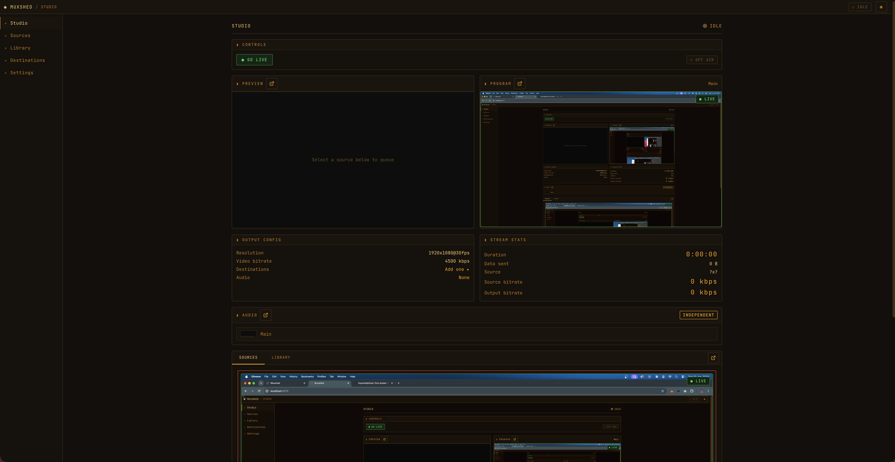

Self-hosted multistream studio. Ingest from any source (OBS, hardware encoders, mobile, browser) over RTMP, SRT, or WebRTC (WHIP coming soon). Switch between inputs live in a browser-based production switcher. Fan-out to every platform at once: YouTube, Twitch, Kick, Facebook, or any custom RTMP/RTMPS endpoint.

One stream in, or many. Every destination, simultaneously. No cloud middleman, no per-channel fees, no limits.

The open source, self-hosted alternative to Restream, StreamYard, and vMix.

**[Join the community on Discord →](https://discord.gg/CZYjFu6vu)**



## Inspiration

This started years ago as a passion project to understand the complexities of muxing live video automatically. It was recently brought back to life earlier 2026 using Rust for a lot of the application compontents. 

## Features

- RTMP and SRT ingest from OBS, encoders, or any streaming software
- Fan-out to YouTube, Twitch, Kick, and any custom RTMP/RTMPS endpoint
- **Program failover.** When your source goes offline (e.g. an IRL stream drops), the
  program automatically switches to a fallback source (a "be right back" image/video or a
  backup ingress) so your destinations stay connected, then switches back when it returns
- **Public watch page.** Broadcast to your own self-hosted, unlisted `/watch/<token>`
  page with optional viewer password and custom branding (no external destination required)
- **Scheduled broadcasts.** Upload videos and have them go to air on their own, at a set
  time or on a repeating schedule: a single premiere, a playlist, or a looping 24/7 channel
- Scene management with a multi-layer compositor and per-layer fit (fill / contain / cover)
- **Browser and media sources.** Add a live web page, or an image/video from the library,
  as a scene layer
- Audio mixer with per-source levels, mute, and audio-follows-video routing
- Media library for images, video, and overlays
- Stinger transitions with frame-accurate marker editing
- Image overlays
- Local recording
- WebRTC guest links
- API key authentication
- Real-time WebSocket state feed
- Stream Deck and Bitfocus Companion control

### Coming Soon
- WHIP (WebRTC) ingest

## Public Watch Page

Every instance can broadcast its program output to a self-hosted, publicly-watchable page,
no YouTube or Twitch required. Open the **Channel** section, set a title/logo/accent colour,
optionally add a viewer password, and share the unlisted link (`/watch/<token>`).

- Streams over HLS, produced by ffmpeg, and starts automatically when you go live.
- The watch page has a built-in player (play/pause, mute, fullscreen, plus restart and a
  seek bar for on-demand playback) and shows an `ON AIR` / `OFFLINE` state. It auto-starts
  when the broadcast begins, with no refresh needed.
- The link is unlisted; add a password to restrict it further. Regenerate the link any
  time to revoke access.

## Scheduled Broadcasts

Upload videos to the library and have them go to air on their own, with no operator at the desk.
Open the **Schedules** section and build a schedule from one or more videos.

- Fire once at a set date and time, or repeat on a cron schedule. Times are evaluated in a
  timezone you pick for the instance (set it under Settings), so DST is handled correctly.
- Add several videos to a playlist and they play back-to-back as one continuous stream,
  scaled onto a common canvas so mixed resolutions join cleanly.
- Pick what happens when the playlist ends: stop, hold on a standby card, or loop the whole
  playlist as an always-on 24/7 channel.
- A scheduled broadcast airs to the destinations you choose (or every enabled destination)
  and your public watch page, exactly like a manual go-live. Edit or air a schedule on
  demand from the same screen.

## Stream Deck & Bitfocus Companion

Control Muxshed from hardware. Both connect to your instance over its API (host + API key)
and react to live state. Create an API key under **Settings → API Keys**, then enter your
instance host and the key in the plugin/module configuration.

- **[Elgato Stream Deck plugin](https://github.com/muxshed/streamdeck-plugin)** for one-press
  Go Live, End Stream, and Record toggle.
- **[Bitfocus Companion module](https://github.com/muxshed/companion-module-muxshed)** to go
  live, cut scenes/sources, show/hide overlays, and record, with on-air/recording
  feedback, live variables, and ready-made presets.

## Architecture

```
crates/
  api/         Axum REST + WebSocket API server; RTMP ingest/relay + ffmpeg egress/HLS
  processor/   PipelineController trait (state) + stub controller
  common/      Shared types, config, errors
web/           SvelteKit frontend (TypeScript, Tailwind)
docker/        Dockerfile, compose files, Unraid template
migrations/    SQLite migrations
```

Media is handled by a custom Rust RTMP/FLV relay (`crates/api/src/rtmp/`, `egress.rs`)
plus **ffmpeg** subprocesses for transcoding and HLS. RTMP fan-out is forwarded (not
re-encoded); the public watch page is the one transcoded output (`channel_hls.rs`).

> A GStreamer compositor pipeline is in active development behind the `gstreamer` Cargo
> feature. The media engine that ships today is ffmpeg.

## Requirements

### Source (local development)

- Rust 1.88+ and Cargo
- Node.js 20+ and npm
- **ffmpeg** for RTMP ingest/fan-out, recording, and the public watch page (HLS)

### Docker / Podman

- Docker 24+ or Podman 4+
- docker compose or podman-compose

## Installing Dependencies from Source

### Rust

```sh
# Install via rustup (https://rustup.rs)
curl --proto '=https' --tlsv1.2 -sSf https://sh.rustup.rs | sh
```

### Node.js

```sh
# Install via nvm (https://github.com/nvm-sh/nvm)
nvm install 20
nvm use 20
```

### ffmpeg

ffmpeg powers RTMP ingest/fan-out, recording, and the public watch page (HLS). The Docker
images bundle it; for local development install it from your package manager:

```sh
# macOS
brew install ffmpeg

# Ubuntu / Debian
sudo apt-get update && sudo apt-get install -y ffmpeg

# Fedora / RHEL
sudo dnf install -y ffmpeg

# Arch Linux
sudo pacman -S ffmpeg
```

Verify with `ffmpeg -version`.

## Quick Start

### Source

```sh
./dev.sh
```

This builds and runs the API on `http://localhost:8080` and the frontend dev server on `http://localhost:5173`. The frontend proxies API requests to the backend automatically.

On first run, a default API key is printed to the console. Copy it and enter it in the frontend when prompted.

### Docker

```sh
./dev-docker.sh
```

Builds a dev image (stub controller, debug logging) and starts on `http://localhost:8080`. The frontend is served directly by the API.

### Podman

```sh
./dev-podman.sh
```

Same as Docker but uses `podman compose`.

### Production Docker

```sh
cd docker
docker compose up --build
```

Builds the production image (ffmpeg-based). Ports:

| Port | Protocol | Purpose |
|------|----------|---------|
| 8080 | TCP | Web UI + API |
| 1935 | TCP | RTMP ingest |
| 9000 | UDP | SRT ingest |
| 8443 | TCP | WebRTC signalling |

## Configuration

All configuration is via environment variables. See `.env.example` for the full list.

| Variable | Default | Description |
|----------|---------|-------------|
| `MUXSHED_LISTEN_ADDR` | `0.0.0.0:8080` | API server bind address |
| `MUXSHED_RTMP_PORT` | `1935` | RTMP ingest port |
| `MUXSHED_DB_PATH` | `muxshed.db` | SQLite database file path |
| `MUXSHED_DATA_DIR` | `data` | Directory for recordings, stingers, etc. |
| `MUXSHED_WEB_DIR` | *(none)* | Path to built frontend assets (set automatically in Docker) |
| `MUXSHED_HEADLESS` | `false` | Run API-only, no web UI (see below) |
| `MUXSHED_API_KEY` | *(none)* | Preseed an admin API key at startup (used in headless mode) |
| `MUXSHED_LOG_LEVEL` | `info` | Log level: trace, debug, info, warn, error |
| `RUST_LOG` | `info` | Rust log filter (overrides `MUXSHED_LOG_LEVEL` for fine-grained control) |

## Headless Mode

Run Muxshed API-only, with no web UI, for CLI or API workflows. Set
`MUXSHED_HEADLESS=true` and preseed a key with `MUXSHED_API_KEY`. The full API is
available; the root returns a JSON notice instead of the app. A slim image without
the web build stage is at `docker/Dockerfile.headless`.

```sh
MUXSHED_HEADLESS=true MUXSHED_API_KEY=mxs_your_key ./target/release/muxshed-api
```

Interactive API docs are served on every instance at `/api/v1/docs` (Scalar), with the
OpenAPI document at `/api/v1/openapi.json`.

## Running Tests

```sh
# Rust tests (API integration tests)
cargo test --workspace

# Frontend type checking
cd web && npx svelte-check

# Frontend build
cd web && npm run build
```

## API

All endpoints are under `/api/v1/`. Authentication is via `X-API-Key` header or `?key=` query parameter.

Key endpoints:

```
POST   /api/v1/stream/start          Start streaming to all enabled destinations
POST   /api/v1/stream/stop           Stop streaming
GET    /api/v1/status                Pipeline state

GET    /api/v1/failover              Program failover config (PUT to update)

GET    /api/v1/sources               List sources
POST   /api/v1/sources               Create source (auto-generates RTMP stream key)

GET    /api/v1/scenes                List scenes
POST   /api/v1/scenes/:id/activate   Switch to scene

GET    /api/v1/destinations          List destinations
POST   /api/v1/destinations          Create destination

POST   /api/v1/transition/stinger    Trigger stinger transition

POST   /api/v1/record/start          Start recording
POST   /api/v1/record/stop           Stop recording

GET    /api/v1/schedules             List schedules
POST   /api/v1/schedules             Create a schedule
POST   /api/v1/schedules/:id/run     Air a schedule now

GET    /api/v1/ws?key=API_KEY        WebSocket for real-time state updates
```

## Docker Volumes

| Container Path | Purpose |
|----------------|---------|
| `/config` | Database and configuration |
| `/config/recordings` | Local recordings |
| `/config/stingers` | Stinger transition files |

## Unraid

An Unraid community app template is included at `docker/unraid-template.xml`.

## License

[GNU Affero General Public License v3.0](LICENSE) (AGPL-3.0-only)

Muxshed is free software: self-host it, modify it, and run it however you like. If you
run a modified version as a network service, the AGPL requires you to offer your users
the corresponding source. See [LICENSE](LICENSE) for full terms.
